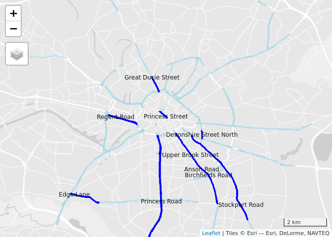
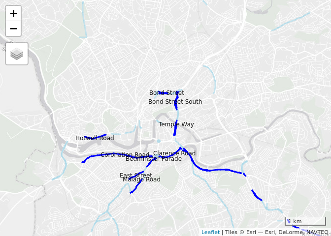

<!-- README.md is generated from README.Rmd. Please edit that file -->

# Data analysis to support temporary cycleways

<!-- badges: start -->

<!-- badges: end -->

The goal of this project is to flag roads on which there is

  - high cycling potential
  - road space that could be re-allocated

in the context of increased for demand for cycling to keyworker
workplaces.

It is based on an analysis of data generated for the Department for
Transport funded projects the Propensity to Cycle Tool (PCT) and the
Cycling Infrastructure Prioritisation Toolkit (CyIPT).

The first stage was to identify cities with high cycling potential. We
did this by analysing data from the PCT project and selecting the top 10
cities in terms of long term cycling potential, plus Sheffield and
Cambridge, presented in the table and figure below:

| name       |     all | bicycle | dutch\_slc |
| :--------- | ------: | ------: | ---------: |
| London     | 3634280 |  155694 |     759755 |
| Birmingham |  392517 |    6476 |      76169 |
| Manchester |  199011 |    8447 |      54419 |
| Leeds      |  326680 |    6250 |      51046 |
| Liverpool  |  185117 |    3978 |      48306 |
| Hull       |  105527 |    8974 |      39302 |
| Bristol    |  192881 |   15797 |      37909 |
| Newcastle  |  197070 |    4545 |      37327 |
| Leicester  |  128501 |    4999 |      35253 |
| Portsmouth |   89822 |    7038 |      28036 |
| Sheffield  |  226477 |    4276 |      25973 |
| Cambridge  |   53295 |   17313 |      20056 |

Top 10 cities by cycling potential in England, with ‘all’ representing
all commuters in the 2011 Census, ‘bicycle’ representing the number who
cycled to work and ‘dutch\_slc’ the number who could cycle to work under
a ‘Go Dutch’ scenario of cycling uptake.

<!-- -->

These 12 study cities coincidentally represent almost exactly 1/4 of the
population in England. Welsh and Scottish cities with high cycling
potential such as Cardiff and Edinbugh were not included in the analysis
because the CyIPT does not currently have data outside of England,
although we could extend the methods to cover all UK cities at some
point.

Below we show the results for a selection of cities, with cycling
potential on the road network visualised under the ‘Government Target’
scenario, which represents a doubling in cycling compared with 2011
levels. London is close to meeting this target already.

We filtered-out roads with low levels of cycling potential and focus
only on roads that have at least one ‘spare lane’, defined as having
more than 1 lane in either direction. Roads that could be made oneway,
or that could be converted into ‘liveable streets’ by preventing through
traffic were not considered.

# London

<!-- -->

The top 10 roads:

<!-- -->

| name                 | ref   | highway | region | pctgov | length |
| :------------------- | :---- | :------ | :----- | -----: | -----: |
| Kennington Park Road | A3    | trunk   | London |   3255 |    925 |
| Brixton Road         | A23   | trunk   | London |   2606 |   2849 |
| Stoke Newington Road | A10   | trunk   | London |   2501 |    590 |
| Talgarth Road        | A4    | trunk   | London |   2480 |   1454 |
| Camberwell New Road  | A202  | trunk   | London |   2420 |   1630 |
| Waterloo Bridge      | A301  | primary | London |   2398 |   1166 |
| Theobalds Road       | A401  | primary | London |   2267 |    565 |
| Whitechapel Road     | A11   | trunk   | London |   2111 |   1560 |
| Old Street           | A5201 | primary | London |   2012 |    505 |
| West Cromwell Road   | A4    | trunk   | London |   1971 |   1024 |

# Leeds

<!-- -->

The top 10 roads:

<!-- -->

| name              | ref   | highway   | region | pctgov | length |
| :---------------- | :---- | :-------- | :----- | -----: | -----: |
| Wellington Street |       | secondary | Leeds  |    546 |   1027 |
| Woodhouse Lane    | A660  | trunk     | Leeds  |    368 |   2373 |
| Otley Road        | A660  | trunk     | Leeds  |    325 |   7273 |
| Crown Point Road  | A653  | primary   | Leeds  |    316 |    652 |
| Broadway          | A6120 | trunk     | Leeds  |    267 |   1042 |
| Kirkstall Road    | A65   | primary   | Leeds  |    261 |   3774 |
| Clay Pit Lane     | A58   | trunk     | Leeds  |    257 |   2163 |
| Dewsbury Road     | A6110 | trunk     | Leeds  |    231 |    539 |
| Hunslet Road      | A639  | primary   | Leeds  |    221 |   1860 |
| The Headrow       |       | service   | Leeds  |    216 |    547 |

# Cambridge

<!-- -->

The top 10 roads:

<!-- -->

| name                  | ref   | highway     | region    | pctgov | length |
| :-------------------- | :---- | :---------- | :-------- | -----: | -----: |
| Saint Andrew’s Street |       | residential | Cambridge |   2449 |    164 |
| Hobson Street         |       | residential | Cambridge |   2393 |    216 |
| Hills Road            | A1307 | primary     | Cambridge |   1662 |    147 |
| Bridge Street         |       | residential | Cambridge |    878 |    194 |
| Elizabeth Way         | A1134 | primary     | Cambridge |    860 |    812 |
|                       | A1134 | primary     | Cambridge |    639 |    187 |
| Emmanuel Street       |       | residential | Cambridge |    586 |    151 |
| Chesterton Road       | A1134 | primary     | Cambridge |    530 |    194 |
